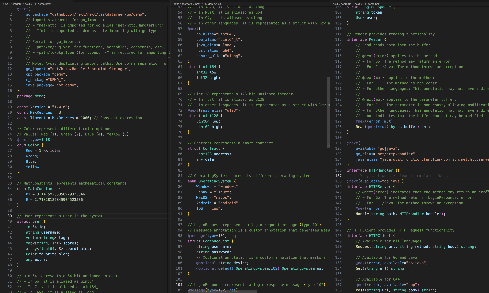

# Next Language 🚀

Next is a powerful Generic **Interface Definition Language (IDL)** designed to create highly customized code across multiple programming languages. It leverages a flexible template system to transform high-level specifications into language-specific implementations.

[Language Specification](./website/docs/language_spec.md) | [API](./website/docs/api.md)

## Screenshot

## ✨ Key Features

- 🌐 Multi-language code generation from a single source
- 📝 Powerful templating system based on Go's text/template
- 🧩 Flexible customization through template inheritance and overloading
- 🏗️ Rich type system supporting interfaces, structs, enums, and various data types
- 🏷️ Annotation support for metadata and customization

## 📚 Built-in Language Support

Next includes built-in templates for various languages, including **C**, **C++**, **C#**, **Go**, **Java**, **JavaScript**, **Kotlin**, **Lua**, **Objective-C**, **PHP**, **Protobuf**, **Python**, **R**, **Rust**, **Swift**, **TypeScript**. These serve as a foundation for code generation and can be easily customized or extended using the template hierarchy system.

## 🛠️ Template System

Next uses a template system based on Go's [text/template](https://pkg.go.dev/text/template/) package, with custom enhancements for code generation. Templates in Next use the `.npl` file extension.

### 📊 Template Hierarchy and Inheritance

Next implements a three-layer template hierarchy, allowing for easy customization and overriding of default behaviors:

1. Next builtin base templates: `next/<object_type>`
2. Next builtin language-specific templates: `next/<lang>/<object_type>`
3. User-defined language-specific templates: `<lang>/<object_type>`

This hierarchy enables a powerful inheritance and overloading mechanism, similar to class inheritance in object-oriented programming.

When rendering a template, Next searches for the most specific template first (user-defined), then falls back to language-specific templates, and finally to base templates if no overrides are found.

## 📖 Documentation

For detailed information on Next's syntax, features, and usage, please visit the official website at [https://next.as](https://next.as). The website provides comprehensive documentation, tutorials, and examples to help you get started with Next and make the most of its capabilities.

## 📝 TODO

- [ ] Support more built-in templates for additional programming languages

## 🤝 Contributing

We welcome contributions to Next Language! Please see our [Contribution Guidelines](CONTRIBUTING.md) for more information on how to get started.

## 📄 License

Next is released under the [MIT License](LICENSE).
