<!-- Generated by "github.com/gopherd/tools/cmd/docgen"; DO NOT EDIT! -->

# API Reference

<ul>
  <li><a href="#user-content-Context">Context</a></li>
<ul>
    <li><a href="#user-content-Context_align">align</a></li>
    <li><a href="#user-content-Context_env">env</a></li>
    <li><a href="#user-content-Context_error">error</a></li>
    <li><a href="#user-content-Context_errorf">errorf</a></li>
    <li><a href="#user-content-Context_exist">exist</a></li>
    <li><a href="#user-content-Context_head">head</a></li>
    <li><a href="#user-content-Context_lang">lang</a></li>
    <li><a href="#user-content-Context_load">load</a></li>
    <li><a href="#user-content-Context_meta">meta</a></li>
    <li><a href="#user-content-Context_next">next</a></li>
    <li><a href="#user-content-Context_pwd">pwd</a></li>
    <li><a href="#user-content-Context_render">render</a></li>
    <li><a href="#user-content-Context_super">super</a></li>
    <li><a href="#user-content-Context_this">this</a></li>
    <li><a href="#user-content-Context_type">type</a></li>
</ul>
  <li><a href="#user-content-Object">Object</a></li>
<ul>
    <li><a href="#user-content-Object_ArrayType">ArrayType</a></li>
    <li><a href="#user-content-Object_Comment">Comment</a></li>
    <li><a href="#user-content-Object_Common">Common</a></li>
<ul>
      <li><a href="#user-content-Object_Common_Annotation">Annotation</a></li>
<ul>
        <li><a href="#user-content-Object_Common_Annotation_decl">decl</a></li>
        <li><a href="#user-content-Object_Common_Annotation_enum">enum</a></li>
        <li><a href="#user-content-Object_Common_Annotation_interface">interface</a></li>
        <li><a href="#user-content-Object_Common_Annotation_method">method</a></li>
        <li><a href="#user-content-Object_Common_Annotation_package">package</a></li>
        <li><a href="#user-content-Object_Common_Annotation_param">param</a></li>
        <li><a href="#user-content-Object_Common_Annotation_struct">struct</a></li>
</ul>
      <li><a href="#user-content-Object_Common_Annotations">Annotations</a></li>
      <li><a href="#user-content-Object_Common_Decl">Decl</a></li>
      <li><a href="#user-content-Object_Common_Fields">Fields</a></li>
      <li><a href="#user-content-Object_Common_List">List</a></li>
      <li><a href="#user-content-Object_Common_Node">Node</a></li>
      <li><a href="#user-content-Object_Common_Symbol">Symbol</a></li>
      <li><a href="#user-content-Object_Common_Type">Type</a></li>
<ul>
        <li><a href="#user-content-Object_Common_Type_Kind">Kind</a></li>
</ul>
</ul>
    <li><a href="#user-content-Object_Const">Const</a></li>
    <li><a href="#user-content-Object_Consts">Consts</a></li>
    <li><a href="#user-content-Object_Decls">Decls</a></li>
    <li><a href="#user-content-Object_Doc">Doc</a></li>
    <li><a href="#user-content-Object_Enum">Enum</a></li>
    <li><a href="#user-content-Object_EnumMember">EnumMember</a></li>
    <li><a href="#user-content-Object_EnumMembers">EnumMembers</a></li>
    <li><a href="#user-content-Object_EnumType">EnumType</a></li>
    <li><a href="#user-content-Object_Enums">Enums</a></li>
    <li><a href="#user-content-Object_File">File</a></li>
    <li><a href="#user-content-Object_Import">Import</a></li>
    <li><a href="#user-content-Object_Imports">Imports</a></li>
    <li><a href="#user-content-Object_Interface">Interface</a></li>
    <li><a href="#user-content-Object_InterfaceMethod">InterfaceMethod</a></li>
    <li><a href="#user-content-Object_InterfaceMethodParam">InterfaceMethodParam</a></li>
    <li><a href="#user-content-Object_InterfaceMethodParams">InterfaceMethodParams</a></li>
    <li><a href="#user-content-Object_InterfaceMethodResult">InterfaceMethodResult</a></li>
    <li><a href="#user-content-Object_InterfaceMethods">InterfaceMethods</a></li>
    <li><a href="#user-content-Object_InterfaceType">InterfaceType</a></li>
    <li><a href="#user-content-Object_Interfaces">Interfaces</a></li>
    <li><a href="#user-content-Object_MapType">MapType</a></li>
    <li><a href="#user-content-Object_Package">Package</a></li>
    <li><a href="#user-content-Object_PrimitiveType">PrimitiveType</a></li>
    <li><a href="#user-content-Object_Struct">Struct</a></li>
    <li><a href="#user-content-Object_StructField">StructField</a></li>
    <li><a href="#user-content-Object_StructFields">StructFields</a></li>
    <li><a href="#user-content-Object_StructType">StructType</a></li>
    <li><a href="#user-content-Object_Structs">Structs</a></li>
    <li><a href="#user-content-Object_UsedType">UsedType</a></li>
    <li><a href="#user-content-Object_Value">Value</a></li>
    <li><a href="#user-content-Object_VectorType">VectorType</a></li>
</ul>
</ul>

<h2><a id="user-content-Context" target="_self">Context</a></h2>

`Context` related methods and properties are used to retrieve information, perform operations, and generate code within the current code generator's context. These methods or properties are called directly by name, for example: 

```npl
{{head}}
{{next this}}
{{lang}}
{{exist meta.path}}
```

<h3><a id="user-content-Context_align" target="_self">align</a></h3>

`align` aligns the given text with the same indent as the first line. 
Example (without align): 
```npl
	{{print "hello\nworld"}}
```

Output: 
```
	hello
world
```

To align it, you can use `align`: 
```npl
	{{align "hello\nworld"}}
```

Output: 

```
	hello
	world
```

It's useful when you want to align the generated content, especially for multi-line strings (e.g., comments).

<h3><a id="user-content-Context_env" target="_self">env</a></h3>

`env` represents the environment variables defined in the command line with the flag `-D`. 
Example: 
```sh
$ next -D PROJECT_NAME=demo
```


```npl
{{env.PROJECT_NAME}}
```

<h3><a id="user-content-Context_error" target="_self">error</a></h3>

`error` used to return an error message in the template. 
Example: 
```npl
{{error "Something went wrong"}}
```

<h3><a id="user-content-Context_errorf" target="_self">errorf</a></h3>

`errorf` used to return a formatted error message in the template. 
- **Parameters**: (_format_: string, _args_: ...any)

Example: 
```npl
{{errorf "%s went wrong" "Something"}}
```

<h3><a id="user-content-Context_exist" target="_self">exist</a></h3>

`exist` checks whether the given path exists. If the path is not absolute, it will be resolved relative to the current output directory for the current language by command line flag `-O`. 
Example: 
```npl
{{exist "path/to/file"}}
{{exist "/absolute/path/to/file"}}
{{exist meta.path}}
```

<h3><a id="user-content-Context_head" target="_self">head</a></h3>

`head` outputs the header of the generated file. 
Example: 
```
{{head}}
```

Output (for c++): 
```
// Code generated by "next v0.0.1"; DO NOT EDIT.
```

Output (for c): 
```
/* Code generated by "next v0.0.1"; DO NOT EDIT. */
```

<h3><a id="user-content-Context_lang" target="_self">lang</a></h3>

`lang` represents the current language to be generated. 
Example: 
```npl
{{lang}}
{{printf "%s_alias" lang}}
```

<h3><a id="user-content-Context_load" target="_self">load</a></h3>

`load` loads a template file. It will execute the template immediately but ignore the output. It's useful when you want to load a template file and import the templates it needs. 
Example: 
```npl
{{load "path/to/template.npl"}}
```

<h3><a id="user-content-Context_meta" target="_self">meta</a></h3>

`meta` represents the metadata of a entrypoint template file by flag `-T`. To define a meta, you should define a template with the name `meta/<key>`. Currently, the following meta keys are used by the code generator: 
- `meta/this`: the current object to be rendered. See [this](#user-content-Context_this) for more details.
- `meta/path`: the output path for the current object. If the path is not absolute, it will be resolved relative to the current output directory for the current language by command line flag `-O`.
- `meta/skip`: whether to skip the current object.

Any other meta keys are user-defined. You can use them in the templates like `{{meta.<key>}}`. 
Example: 
```npl
{{- define "meta/this" -}}file{{- end -}}
{{- define "meta/path" -}}path/to/file{{- end -}}
{{- define "meta/skip" -}}{{exist meta.path}}{{- end -}}
{{- define "meta/custom" -}}custom value{{- end -}}
```

**The metadata will be resolved in the order of the template definition before rendering the entrypoint template.**

<h3><a id="user-content-Context_next" target="_self">next</a></h3>

`next` executes the next template with the given [object](#user-content-Object). `{{next object}}` is equivalent to `{{render (object.Typeof) object}}`. 
Example: 
```npl
{{- /* Overrides "next/go/struct": add method 'MessageType' for each message after struct */ -}}
{{- define "go/struct"}}
{{- super .}}
{{- with .Annotations.message.type}}

func ({{next $.Type}}) MessageType() int { return {{.}} }
{{- end}}
{{- end -}}

{{next this}}
```

<h3><a id="user-content-Context_pwd" target="_self">pwd</a></h3>

`pwd` returns the current template file's directory. 
Example: 
```npl
{{pwd}}
```

<h3><a id="user-content-Context_render" target="_self">render</a></h3>

`render` executes the template with the given name and data. 
- **Parameters**: (_name_: string, _data_: any[, _lang_: string])

`name` is the template name to be executed. `lang` is the current language by default if not specified. 
`name` has a specific format. When the corresponding template is not found, it will look up the parent template according to the rules of [super](#user-content-Context_super). 
Example: 
```npl
{{render "go/struct" this}}
{{render "struct" this "go"}}
```

<h3><a id="user-content-Context_super" target="_self">super</a></h3>

`super` executes the super template with the given [object](#user-content-Object). super is used to call the parent template in the current template. It's useful when you want to extend the parent template. The super template looks up the template with the following priority: 

```mermaid
%%{init: {'theme': 'base', 'themeVariables': { 'primaryColor': '#f0f8ff', 'primaryBorderColor': '#7eb0d5', 'lineColor': '#5a9bcf', 'primaryTextColor': '#333333' }}}%%
flowchart LR
A["<span style='color:#9095FF'>type</span><span style='color:#E59C00'>[:name]</span>"] --> |<span style='color:#5a9bcf'>super</span>| B["<span style='color:#67D7E5'>lang</span>/<span style='color:#9095FF'>type</span><span style='color:#E59C00'>[:name]</span>"]
B --> |<span style='color:#5a9bcf'>super</span>| C["<span style='color:#58B7FF'>next</span>/<span style='color:#67D7E5'>lang</span>/<span style='color:#9095FF'>type</span><span style='color:#E59C00'>[:name]</span>"]
C --> |<span style='color:#5a9bcf'>super</span>| D["<span style='color:#58B7FF'>next</span>/<span style='color:#9095FF'>type</span><span style='color:#E59C00'>[:name]</span>"]

classDef default fill:#f0f8ff,stroke:#7eb0d5,stroke-width:1.5px,rx:12,ry:12;
linkStyle default stroke:#5a9bcf,stroke-width:1.5px;
```



e.g., 
- `struct` -> `go/struct` -> `next/go/struct` -> `next/struct`
- `struct:foo` -> `go/struct:foo` -> `next/go/struct:foo` -> `next/struct:foo`

Example: 
```npl
{{- /* Overrides "next/go/struct": add method 'MessageType' for each message after struct */ -}}
{{- define "go/struct"}}
{{- super .}}
{{- with .Annotations.message.type}}

func ({{next $.Type}}) MessageType() int { return {{.}} }
{{- end}}
{{- end -}}
```

<h3><a id="user-content-Context_this" target="_self">this</a></h3>

`this` represents the current [declaration](#user-content-Object_Common_Decl) object to be rendered. this defined in the template [meta](#user-content-meta) `meta/this`. Supported types are: 
- [package](#user-content-Object_Package)
- [file](#user-content-Object_File)
- [const](#user-content-Object_Const)
- [enum](#user-content-Object_Enum)
- [struct](#user-content-Object_Struct)
- [interface](#user-content-Object_Interface)

It's a [file](#user-content-Object_File) by default.

<h3><a id="user-content-Context_type" target="_self">type</a></h3>

`type` outputs the string representation of the given [type](#user-content-Object_Common_Type) for the current language. The type function will lookup the type mapping in the command line flag `-M` and return the corresponding type. If the type is not found, it will lookup <LANG>.map file (e.g., cpp.map) for the type mapping. If the type is still not found, it will return an error.

<h2><a id="user-content-Object" target="_self">Object</a></h2>

`Object` is a generic object type. These objects can be used as parameters for the [next](#user-content-Context_next) function, like `{{next .}}`.

<h6><a id="user-content-Object_-Typeof" target="_self">.Typeof</a></h6>

`.Typeof` returns the type name of the object. The type name is a string that represents the type of the object. Except for objects under [Common](#user-content-Object_Common), the type names of other objects are lowercase names separated by dots. For example, the type name of a `EnumMember` object is `enum.member`, and the type name of a `Enum` object is `enum`. These objects can be customized for code generation by defining templates. 
Example: 

```next
package demo;

enum Color {
	Red = 1;
	Green = 2;
	Blue = 3;
}
```


```npl
{{- define "go/enum.member" -}}
const {{next .Name}} = {{.Value}}
{{- end}}

{{- define "go/enum.member:name" -}}
{{.Decl.Name}}_{{.}}
{{- end}}
```

Output: 
```go
package demo

type Color int

const Color_Red = 1
const Color_Green = 2
const Color_Blue = 3
```

These two definitions will override the built-in template functions `next/go/enum.member` and `next/go/enum.member.name`.

<h3><a id="user-content-Object_ArrayType" target="_self">ArrayType</a></h3>

`ArrayType` represents an array [type](#user-content-Object_Common_Type).

<h6><a id="user-content-Object_ArrayType_-ElemType" target="_self">.ElemType</a></h6>

`.ElemType` represents the element [type](#user-content-Object_Common_Type) of the array.

<h6><a id="user-content-Object_ArrayType_-N" target="_self">.N</a></h6>

`.N` represents the number of elements in the array.

<h3><a id="user-content-Object_Comment" target="_self">Comment</a></h3>

`Comment` represents a line comment or a comment group in Next source code. Use this in templates to access and format comments.

<h6><a id="user-content-Object_Comment_-String" target="_self">.String</a></h6>

`.String` returns the full original comment text, including delimiters. 
Usage in templates: 
```npl
{{.Comment.String}}
```

<h6><a id="user-content-Object_Comment_-Text" target="_self">.Text</a></h6>

`.Text` returns the content of the comment without comment delimiters. 
Usage in templates: 
```npl
{{.Comment.Text}}
```

<h3><a id="user-content-Object_Common" target="_self">Common</a></h3>

`Common` contains some general types, including a generic type. Unless specifically stated, these objects cannot be directly called using the [next](#user-content-Context_next) function. The [Value](#user-content-Object_Common_Value) object represents a value, which can be either a constant value or an enum member's value. The object type for the former is `const.value`, and for the latter is `enum.member.value`.

<h4><a id="user-content-Object_Common_Annotation" target="_self">Annotation</a></h4>

`Annotation` represents an annotation by `name` => value. 
Annotation is a map that stores the parameters of a single annotation. It allows for flexible parameter types, including strings, numbers, booleans and [types](#user-content-Object_Common_Type). 
Example: 
Next code: 

```next

@json(omitempty)
@event(name="Login")
@message(name="Login", type=100)
struct Login {}

@next(type=int8)
enum Color {
	Red = 1;
	Green = 2;
	Blue = 3;
}
```

Will be represented as: 

```npl
{{- define "go/struct" -}}
{{.Annotations.json.omitempty}}
{{.Annotations.event.name}}
{{.Annotations.message.name}}
{{.Annotations.message.type}}
{{- end}}

{{- define "go/enum" -}}
{{.Annotations.next.type}}
{{- end}}
```

Output: 
```
true
Login
Login
100
```

The `next` annotation is used to pass information to the next compiler. It's a reserved annotation and should not be used for other purposes. The `next` annotation can be annotated to `package` statements, `const` declarations, `enum` declarations, `struct` declarations, `field` declarations, `interface` declarations, `method` declarations, and `parameter` declarations.

<h5><a id="user-content-Object_Common_Annotation_decl" target="_self">decl</a></h5>
<h6><a id="user-content-Object_Common_Annotation_decl_-available" target="_self">.available</a></h6>

The `@next(available="expression")` annotation for `file`, `const`, `enum`, `struct`, `field`, `interface`, `method` availability of the declaration. 
Example: 
```next
@next(available="c|cpp|java|go|csharp")
struct Point {
	int x;
	int y;

	@next(available="c | cpp | go")
	int z;

	@next(available="!java & !c")
	int w;
}
```

<h5><a id="user-content-Object_Common_Annotation_enum" target="_self">enum</a></h5>

The `next` annotation for `enum` declarations used to control the enum behavior.

<h6><a id="user-content-Object_Common_Annotation_enum_-type" target="_self">.type</a></h6>

`.type` specifies the underlying type of the enum. 
Example: 
```next
@next(type=int8)
enum Color {
	Red = 1;
	Green = 2;
	Blue = 3;
}
```

Output in Go: 
```go
type Color int8

const (
	ColorRed Color = 1
	ColorGreen Color = 2
	ColorBlue Color = 3
)
```

Output in C++: 
```cpp
enum class Color : int8_t {
	Red = 1,
	Green = 2,
	Blue = 3,
};
```

<h5><a id="user-content-Object_Common_Annotation_interface" target="_self">interface</a></h5>

The `next` annotation for `interface` declarations used to control the interface behavior. `L_alias` is a alias for the interface name in language `L`. It's used to reference an external type in the target language. 
Example: 
```next
@next(
	available="go|java",
	go_alias="net/http.Handler",
	java_alias="java.util.function.Function<com.sun.net.httpserver.HttpExchange, String>",
)
interface HTTPHandler {}

@next(available="go|java")
interface HTTPServer {
	@next(error)
	Handle(string path, HTTPHandler handler);
}
```

<h5><a id="user-content-Object_Common_Annotation_method" target="_self">method</a></h5>

The `next` annotation for `method` declarations used to control the method behavior.

<h6><a id="user-content-Object_Common_Annotation_method_-error" target="_self">.error</a></h6>

The `@next(error)` annotation used to indicate that the method returns an error or throws an exception. 
Example: 
```next
interface Parser {
	@next(error)
	parse(string s) int;
}
```

Output in Go: 
```go
type Parser interface {
	Parse(s string) (int, error)
}
```

Output in C++: 
```cpp
class Parser {
public:
	int parse(const std::string& s) const;
};
```

Output in Java: 
```java
interface Parser {
	int parse(String s) throws Exception;
}
```

<h6><a id="user-content-Object_Common_Annotation_method_-mut" target="_self">.mut</a></h6>

The `@next(mut)` annotation used to indicate that the method is a mutable method, which means it can modify the object's state. 
Example: 
```next
interface Writer {
	@next(error, mut)
	write(string data);
}
```

Output in Go: 
```go
type Writer interface {
	Write(data string) error
}
```

Output in C++: 
```cpp
class Writer {
public:
	void write(const std::string& data);
};
```

<h5><a id="user-content-Object_Common_Annotation_package" target="_self">package</a></h5>

The `next` annotation for `package` statements used to control the package behavior for specific languages. The `next` annotation can be used to set the package name, package path, and some other package-related information. 
For any language `L`, the `next` annotation for `package` statements is defined as `@next(L_package="package_info")`. 
Example: 
```next
@next(
	c_package="DEMO_",
	cpp_package="demo",
	java_package="com.exmaple.demo",
	go_package="github.com/next/demo",
	csharp_package="demo",
)
```


```npl
{{.Package.Annotations.next.c_package}}
{{.Package.Annotations.next.cpp_package}}
{{.Package.Annotations.next.java_package}}
{{.Package.Annotations.next.go_package}}
{{.Package.Annotations.next.csharp_package}}
```

There are some reserved keys for the `next` annotation for `package` statements.

<h6><a id="user-content-Object_Common_Annotation_package_-go_imports" target="_self">.go_imports</a></h6>

`.go_imports` represents a list of import paths for Go packages, separated by commas: `@next(go_imports="fmt.Printf,*io.Reader")`. Note: **`*` is required to import types.** 
Example: 
```next
@next(go_imports="fmt.Printf,*io.Reader")
package demo;
```

<h5><a id="user-content-Object_Common_Annotation_param" target="_self">param</a></h5>

The `next` annotation for `parameter` declarations used to control the parameter behavior.

<h6><a id="user-content-Object_Common_Annotation_param_-mut" target="_self">.mut</a></h6>

The `@next(mut)` annotation used to indicate that the parameter is mutable. 
Example: 
```next
interface Reader {
	@next(error);
	read(@next(mut) string data);
}
```

Output in Go: 
```go
type Reader interface {
	Read(data string) error
}
```

Output in C++: 
```cpp
class Reader {
public:
	void read(std::string& data);
};
```

<h5><a id="user-content-Object_Common_Annotation_struct" target="_self">struct</a></h5>

The `next` annotation for `struct` declarations used to control the struct behavior. `L_alias` is a alias for the struct name in language `L`. It's used to reference an external type in the target language. 
Example: 
```next
@next(rust_alias="u128")
struct uint128 {
	int64 low;
	int64 high;
}

@next(go_alias="complex128")
struct Complex {
	float64 real;
	float64 imag;
}

struct Contract {
	uint128 address;
	Complex complex;
}
```

This will don't generate the `uint128` struct in the `rust` language, but use `u128` instead. And in the `go` language, it will use `complex128` instead of `Complex`.

<h4><a id="user-content-Object_Common_Annotations" target="_self">Annotations</a></h4>

`Annotations` represents a group of annotations by `name` => [Annotation](#user-content-Object_Common_Annotation). 
Annotations is a map that stores multiple annotations for a given entity. The key is the annotation name (string), and the value is the corresponding [Annotation](#user-content-Object_Common_Annotation) object.

<h4><a id="user-content-Object_Common_Decl" target="_self">Decl</a></h4>

`Decl` represents a top-level declaration in a file. 
All declarations are [nodes](#user-content-Object_Common_Node). Currently, the following declarations are supported: 
- [Package](#user-content-Object_Package)
- [File](#user-content-Object_File)
- [Const](#user-content-Object_Const)
- [Enum](#user-content-Object_Enum)
- [Struct](#user-content-Object_Struct)
- [Interface](#user-content-Object_Interface)

<h4><a id="user-content-Object_Common_Fields" target="_self">Fields</a></h4>

`Fields` represents a list of fields in a declaration.

<h6><a id="user-content-Object_Common_Fields_-Decl" target="_self">.Decl</a></h6>

`.Decl` is the declaration object that contains the fields. 
Currently, it is one of following types: 
- [Enum](#user-content-Object_Enum)
- [Struct](#user-content-Object_Struct)
- [Interface](#user-content-Object_Interface)
- [InterfaceMethod](#user-content-Object_InterfaceMethod).

<h6><a id="user-content-Object_Common_Fields_-List" target="_self">.List</a></h6>

`.List` is the list of fields in the declaration. 
Currently, the field object is one of following types: 
- [EnumMember](#user-content-Object_EnumMember)
- [StructField](#user-content-Object_StructField)
- [InterfaceMethod](#user-content-Object_InterfaceMethod).
- [InterfaceMethodParam](#user-content-Object_InterfaceMethodParam).

<h4><a id="user-content-Object_Common_List" target="_self">List</a></h4>

`List` represents a list of objects.

<h6><a id="user-content-Object_Common_List_-List" target="_self">.List</a></h6>

`.List` represents the list of objects. It is used to provide a uniform way to access.

<h4><a id="user-content-Object_Common_Node" target="_self">Node</a></h4>

`Node` represents a Node in the Next AST. 
Currently, the following nodes are supported: 
- [File](#user-content-Object_File)
- [Const](#user-content-Object_Const)
- [Enum](#user-content-Object_Enum)
- [Struct](#user-content-Object_Struct)
- [Interface](#user-content-Object_Interface)
- [EnumMember](#user-content-Object_EnumMember)
- [StructField](#user-content-Object_StructField)
- [InterfaceMethod](#user-content-Object_InterfaceMethod)
- [InterfaceMethodParam](#user-content-Object_InterfaceMethodParam)

<h6><a id="user-content-Object_Common_Node_-Annotations" target="_self">.Annotations</a></h6>

`.Annotations` represents the [annotations](#user-content-Annotation_Annotations) for the node.

<h6><a id="user-content-Object_Common_Node_-Doc" target="_self">.Doc</a></h6>

`.Doc` represents the documentation comment for the node.

<h6><a id="user-content-Object_Common_Node_-File" target="_self">.File</a></h6>

`.File` represents the file containing the node.

<h6><a id="user-content-Object_Common_Node_-Package" target="_self">.Package</a></h6>

`.Package` represents the package containing the node.

<h4><a id="user-content-Object_Common_Symbol" target="_self">Symbol</a></h4>

`Symbol` represents a Next symbol: value(const, enum member), type(enum, struct, interface).

<h4><a id="user-content-Object_Common_Type" target="_self">Type</a></h4>

`Type` represents a Next type. 
Currently, the following types are supported: 
- [UsedType](#user-content-Object_UsedType)
- [PrimitiveType](#user-content-Object_PrimitiveType)
- [ArrayType](#user-content-Object_ArrayType)
- [VectorType](#user-content-Object_VectorType)
- [MapType](#user-content-Object_MapType)
- [EnumType](#user-content-Object_EnumType)
- [StructType](#user-content-Object_StructType)
- [InterfaceType](#user-content-Object_InterfaceType)

<h6><a id="user-content-Object_Common_Type_-Decl" target="_self">.Decl</a></h6>

`.Decl` represents the [declaration](#user-content-Decl) of the type.

<h6><a id="user-content-Object_Common_Type_-Kind" target="_self">.Kind</a></h6>

`.Kind` returns the [kind](#user-content-Object_Common_Type_Kind) of the type.

<h6><a id="user-content-Object_Common_Type_-String" target="_self">.String</a></h6>

`.String` represents the string representation of the type.

<h6><a id="user-content-Object_Common_Type_-Value" target="_self">.Value</a></h6>

`.Value` returns the reflect value of the type.

<h5><a id="user-content-Object_Common_Type_Kind" target="_self">Kind</a></h5>

`Kind` represents the type kind. Currently, the following kinds are supported: 
- `bool`: true or false
- `int`: integer
- `int8`: 8-bit integer
- `int16`: 16-bit integer
- `int32`: 32-bit integer
- `int64`: 64-bit integer
- `float32`: 32-bit floating point
- `float64`: 64-bit floating point
- `byte`: byte
- `bytes`: byte slice
- `string`: string
- `any`: any object
- `map`: dictionary
- `vector`: vector of elements
- `array`: array of elements
- `enum`: enumeration
- `struct`: structure
- `interface`: interface

<h6><a id="user-content-Object_Common_Type_Kind_-Bits" target="_self">.Bits</a></h6>

`.Bits` returns the number of bits for the type. If the type has unknown bits, it returns 0 (for example, `any`, `string`, `bytes`).

<h6><a id="user-content-Object_Common_Type_Kind_-Compatible" target="_self">.Compatible</a></h6>

`.Compatible` returns the compatible type between two types. If the types are not compatible, it returns `KindInvalid`. If the types are the same, it returns the type. If the types are numeric, it returns the type with the most bits.

<h6><a id="user-content-Object_Common_Type_Kind_-IsAny" target="_self">.IsAny</a></h6>

`.IsAny` reports whether the type is any.

<h6><a id="user-content-Object_Common_Type_Kind_-IsArray" target="_self">.IsArray</a></h6>

`.IsArray` reports whether the type is an array.

<h6><a id="user-content-Object_Common_Type_Kind_-IsBool" target="_self">.IsBool</a></h6>

`.IsBool` reports whether the type is a boolean.

<h6><a id="user-content-Object_Common_Type_Kind_-IsBytes" target="_self">.IsBytes</a></h6>

`.IsBytes` reports whether the type is a byte slice.

<h6><a id="user-content-Object_Common_Type_Kind_-IsFloat" target="_self">.IsFloat</a></h6>

`.IsFloat` reports whether the type is a floating point.

<h6><a id="user-content-Object_Common_Type_Kind_-IsInteger" target="_self">.IsInteger</a></h6>

`.IsInteger` reports whether the type is an integer.

<h6><a id="user-content-Object_Common_Type_Kind_-IsMap" target="_self">.IsMap</a></h6>

`.IsMap` reports whether the type is a map.

<h6><a id="user-content-Object_Common_Type_Kind_-IsNumeric" target="_self">.IsNumeric</a></h6>

`.IsNumeric` reports whether the type is a numeric type.

<h6><a id="user-content-Object_Common_Type_Kind_-IsString" target="_self">.IsString</a></h6>

`.IsString` reports whether the type is a string.

<h6><a id="user-content-Object_Common_Type_Kind_-IsVector" target="_self">.IsVector</a></h6>

`.IsVector` reports whether the type is a vector.

<h6><a id="user-content-Object_Common_Type_Kind_-Valid" target="_self">.Valid</a></h6>

`.Valid` reports whether the type is valid.

<h3><a id="user-content-Object_Const" target="_self">Const</a></h3>

`Const` (extends [Decl](#user-content-Object_Common_Decl)) represents a const declaration.

<h6><a id="user-content-Object_Const_-Comment" target="_self">.Comment</a></h6>

`.Comment` is the line [comment](#user-content-Object_Comment) of the constant declaration.

<h6><a id="user-content-Object_Const_-Type" target="_self">.Type</a></h6>

`.Type` represents the type of the constant.

<h6><a id="user-content-Object_Const_-Value" target="_self">.Value</a></h6>

`.Value` represents the [value object](#user-content-Object_Value) of the constant.

<h3><a id="user-content-Object_Consts" target="_self">Consts</a></h3>

`Consts` represents a [list](#user-content-Object_Common_List) of const declarations.

<h3><a id="user-content-Object_Decls" target="_self">Decls</a></h3>

`Decls` holds all declarations in a file.

<h6><a id="user-content-Object_Decls_-Consts" target="_self">.Consts</a></h6>

`.Consts` represents the [list](#user-content-Object_Common_List) of [const](#user-content-Object_Const) declarations.

<h6><a id="user-content-Object_Decls_-Enums" target="_self">.Enums</a></h6>

`.Enums` represents the [list](#user-content-Object_Common_List) of [enum](#user-content-Object_Enum) declarations.

<h6><a id="user-content-Object_Decls_-Interfaces" target="_self">.Interfaces</a></h6>

`.Interfaces` represents the [list](#user-content-Object_Common_List) of [interface](#user-content-Object_Interface) declarations.

<h6><a id="user-content-Object_Decls_-Structs" target="_self">.Structs</a></h6>

`.Structs` represents the [list](#user-content-Object_Common_List) of [struct](#user-content-Object_Struct) declarations.

<h3><a id="user-content-Object_Doc" target="_self">Doc</a></h3>

`Doc` represents a documentation comment for a declaration in Next source code. Use this in templates to access and format documentation comments.

<h6><a id="user-content-Object_Doc_-Format" target="_self">.Format</a></h6>

`.Format` formats the documentation comment for various output styles. 
Usage in templates: 

```npl
{{.Doc.Format "" " * " "/**\n" " */"}}
```

Example output: 

```c

/**
 * This is a documentation comment.
 * It can be multiple lines.
 */
```

<h6><a id="user-content-Object_Doc_-String" target="_self">.String</a></h6>

`.String` returns the full original documentation comment, including delimiters. 
Usage in templates: 
```npl
{{.Doc.String}}
```

<h6><a id="user-content-Object_Doc_-Text" target="_self">.Text</a></h6>

`.Text` returns the content of the documentation comment without comment delimiters. 
Usage in templates: 
```npl
{{.Doc.Text}}
```

<h3><a id="user-content-Object_Enum" target="_self">Enum</a></h3>

`Enum` (extends [Decl](#user-content-Object_Common_Decl)) represents an enum declaration.

<h6><a id="user-content-Object_Enum_-MemberType" target="_self">.MemberType</a></h6>

`.MemberType` represents the type of the enum members.

<h6><a id="user-content-Object_Enum_-Members" target="_self">.Members</a></h6>

`.Members` is the list of enum members.

<h6><a id="user-content-Object_Enum_-Type" target="_self">.Type</a></h6>

`.Type` is the enum type.

<h3><a id="user-content-Object_EnumMember" target="_self">EnumMember</a></h3>

`EnumMember` (extends [Decl](#user-content-Object_Common_Decl)) represents an enum member object in an [enum](#user-content-Object_Enum) declaration.

<h6><a id="user-content-Object_EnumMember_-Comment" target="_self">.Comment</a></h6>

`.Comment` represents the line [comment](#user-content-Object_Comment) of the enum member declaration.

<h6><a id="user-content-Object_EnumMember_-Decl" target="_self">.Decl</a></h6>

`.Decl` represents the [enum](#user-content-Object_Enum) that contains the member.

<h6><a id="user-content-Object_EnumMember_-Value" target="_self">.Value</a></h6>

`.Value` represents the [value object](#user-content-Object_Value) of the enum member.

<h3><a id="user-content-Object_EnumMembers" target="_self">EnumMembers</a></h3>

`EnumMembers` represents the [list](#user-content-Object_Common_Fields) of [enum members](#user-content-Object_EnumMember).

<h3><a id="user-content-Object_EnumType" target="_self">EnumType</a></h3>

`EnumType` represents the [type](#user-content-Object_Common_Type) of an [enum](#user-content-Object_Enum) declaration.

<h3><a id="user-content-Object_Enums" target="_self">Enums</a></h3>

`Enums` represents a [list](#user-content-Object_Common_List) of enum declarations.

<h3><a id="user-content-Object_File" target="_self">File</a></h3>

`File` (extends [Decl](#user-content-Object_Common_Decl)) represents a Next source file.

<h6><a id="user-content-Object_File_-Decls" target="_self">.Decls</a></h6>

`.Decls` returns the file's all top-level declarations.

<h6><a id="user-content-Object_File_-LookupLocalType" target="_self">.LookupLocalType</a></h6>

`.LookupLocalType` looks up a type by name in the file's symbol table. If the type is not found, it returns an error. If the symbol is found but it is not a type, it returns an error.

<h6><a id="user-content-Object_File_-LookupLocalValue" target="_self">.LookupLocalValue</a></h6>

`.LookupLocalValue` looks up a value by name in the file's symbol table. If the value is not found, it returns an error. If the symbol is found but it is not a value, it returns an error.

<h6><a id="user-content-Object_File_-Name" target="_self">.Name</a></h6>

`.Name` represents the file name without the ".next" extension.

<h6><a id="user-content-Object_File_-Package" target="_self">.Package</a></h6>

`.Package` represents the file's import declarations.

<h6><a id="user-content-Object_File_-Path" target="_self">.Path</a></h6>

`.Path` represents the file full path.

<h3><a id="user-content-Object_Import" target="_self">Import</a></h3>

`Import` represents a file import.

<h6><a id="user-content-Object_Import_-Comment" target="_self">.Comment</a></h6>

`.Comment` represents the import declaration line [comment](#user-content-Object_Comment).

<h6><a id="user-content-Object_Import_-Doc" target="_self">.Doc</a></h6>

`.Doc` represents the import declaration [documentation](#user-content-Object_Doc).

<h6><a id="user-content-Object_Import_-File" target="_self">.File</a></h6>

`.File` represents the file containing the import declaration.

<h6><a id="user-content-Object_Import_-FullPath" target="_self">.FullPath</a></h6>

`.FullPath` represents the full path of the import.

<h6><a id="user-content-Object_Import_-Path" target="_self">.Path</a></h6>

`.Path` represents the import path.

<h6><a id="user-content-Object_Import_-Target" target="_self">.Target</a></h6>

`.Target` represents the imported file.

<h3><a id="user-content-Object_Imports" target="_self">Imports</a></h3>

`Imports` holds a list of imports.

<h6><a id="user-content-Object_Imports_-File" target="_self">.File</a></h6>

`.File` represents the file containing the imports.

<h6><a id="user-content-Object_Imports_-List" target="_self">.List</a></h6>

`.List` represents the list of [imports](#user-content-Object_Import).

<h6><a id="user-content-Object_Imports_-TrimmedList" target="_self">.TrimmedList</a></h6>

`.TrimmedList` represents a list of unique imports sorted by package name.

<h3><a id="user-content-Object_Interface" target="_self">Interface</a></h3>

`Interface` (extends [Decl](#user-content-Object_Common_Decl)) represents an interface declaration.

<h6><a id="user-content-Object_Interface_-Methods" target="_self">.Methods</a></h6>

`.Methods` represents the list of interface methods.

<h6><a id="user-content-Object_Interface_-Type" target="_self">.Type</a></h6>

`.Type` represents the interface type.

<h3><a id="user-content-Object_InterfaceMethod" target="_self">InterfaceMethod</a></h3>

`InterfaceMethod` (extends [Node](#user-content-Object_Common_Node)) represents an interface method declaration.

<h6><a id="user-content-Object_InterfaceMethod_-Comment" target="_self">.Comment</a></h6>

`.Comment` represents the line [comment](#user-content-Object_Comment) of the interface method declaration.

<h6><a id="user-content-Object_InterfaceMethod_-Decl" target="_self">.Decl</a></h6>

`.Decl` represents the interface that contains the method.

<h6><a id="user-content-Object_InterfaceMethod_-Params" target="_self">.Params</a></h6>

`.Params` represents the list of method parameters.

<h6><a id="user-content-Object_InterfaceMethod_-Result" target="_self">.Result</a></h6>

`.Result` represents the return type of the method.

<h3><a id="user-content-Object_InterfaceMethodParam" target="_self">InterfaceMethodParam</a></h3>

`InterfaceMethodParam` (extends [Node](#user-content-Object_Common_Node)) represents an interface method parameter declaration.

<h6><a id="user-content-Object_InterfaceMethodParam_-Method" target="_self">.Method</a></h6>

`.Method` represents the interface method that contains the parameter.

<h6><a id="user-content-Object_InterfaceMethodParam_-Type" target="_self">.Type</a></h6>

`.Type` represents the [type](#user-content-Object_Common_Type) of the parameter.

<h3><a id="user-content-Object_InterfaceMethodParams" target="_self">InterfaceMethodParams</a></h3>

`InterfaceMethodParams` represents the [list](#user-content-Object_Common_Fields) of [interface method parameters](#user-content-Object_InterfaceMethodParam).

<h3><a id="user-content-Object_InterfaceMethodResult" target="_self">InterfaceMethodResult</a></h3>

`InterfaceMethodResult` represents an interface method result.

<h6><a id="user-content-Object_InterfaceMethodResult_-Method" target="_self">.Method</a></h6>

`.Method` represents the interface method that contains the result.

<h6><a id="user-content-Object_InterfaceMethodResult_-Type" target="_self">.Type</a></h6>

`.Type` represents the underlying type of the result.

<h3><a id="user-content-Object_InterfaceMethods" target="_self">InterfaceMethods</a></h3>

`InterfaceMethods` represents the [list](#user-content-Object_Common_Fields) of [interface methods](#user-content-Object_InterfaceMethod).

<h3><a id="user-content-Object_InterfaceType" target="_self">InterfaceType</a></h3>

`InterfaceType` represents the [type](#user-content-Object_Common_Type) of an [interface](#user-content-Object_Interface) declaration.

<h3><a id="user-content-Object_Interfaces" target="_self">Interfaces</a></h3>

`Interfaces` represents a [list](#user-content-Object_Common_List) of interface declarations.

<h3><a id="user-content-Object_MapType" target="_self">MapType</a></h3>

`MapType` represents a map [type](#user-content-Object_Common_Type).

<h6><a id="user-content-Object_MapType_-ElemType" target="_self">.ElemType</a></h6>

`.ElemType` represents the element [type](#user-content-Object_Common_Type) of the map.

<h6><a id="user-content-Object_MapType_-KeyType" target="_self">.KeyType</a></h6>

`.KeyType` represents the key [type](#user-content-Object_Common_Type) of the map.

<h3><a id="user-content-Object_Package" target="_self">Package</a></h3>

`Package` (extends [Decl](#user-content-Object_Common_Decl)) represents a Next package.

<h6><a id="user-content-Object_Package_-Contains" target="_self">.Contains</a></h6>

`.Contains` reports whether the package contains the given type. If the current package is nil, it always returns true. 
Example: 

```npl
{{- define "next/go/used.type" -}}
{{if not (.File.Package.Contains .Type) -}}
{{.Type.Decl.File.Package.Name -}}.
{{- end -}}
{{next .Type}}
{{- end}}
```

<h6><a id="user-content-Object_Package_-Files" target="_self">.Files</a></h6>

`.Files` represents the all declared files in the package.

<h6><a id="user-content-Object_Package_-Name" target="_self">.Name</a></h6>

`.Name` represents the package name string.

<h6><a id="user-content-Object_Package_-Types" target="_self">.Types</a></h6>

`.Types` represents the all declared types in the package.

<h3><a id="user-content-Object_PrimitiveType" target="_self">PrimitiveType</a></h3>

`PrimitiveType` represents a primitive type.

<h3><a id="user-content-Object_Struct" target="_self">Struct</a></h3>

`Struct` (extends [Decl](#user-content-Object_Common_Decl)) represents a struct declaration.

<h6><a id="user-content-Object_Struct_-Fields" target="_self">.Fields</a></h6>

`.Fields` represents the list of struct fields.

<h6><a id="user-content-Object_Struct_-Type" target="_self">.Type</a></h6>

`.Type` represents the struct type.

<h3><a id="user-content-Object_StructField" target="_self">StructField</a></h3>

`StructField` (extends [Node](#user-content-Object_Common_Node)) represents a struct field declaration.

<h6><a id="user-content-Object_StructField_-Comment" target="_self">.Comment</a></h6>

`.Comment` represents the line [comment](#user-content-Object_Comment) of the struct field declaration.

<h6><a id="user-content-Object_StructField_-Decl" target="_self">.Decl</a></h6>

`.Decl` represents the struct that contains the field.

<h6><a id="user-content-Object_StructField_-Type" target="_self">.Type</a></h6>

`.Type` represents the [type](#user-content-Object_Common_Type) of the struct field.

<h3><a id="user-content-Object_StructFields" target="_self">StructFields</a></h3>

`StructFields` represents the [list](#user-content-Object_Common_Fields) of [struct fields](#user-content-Object_StructField).

<h3><a id="user-content-Object_StructType" target="_self">StructType</a></h3>

`StructType` represents the [type](#user-content-Object_Common_Type) of a [struct](#user-content-Object_Struct) declaration.

<h3><a id="user-content-Object_Structs" target="_self">Structs</a></h3>

`Structs` represents a [list](#user-content-Object_Common_List) of struct declarations.

<h3><a id="user-content-Object_UsedType" target="_self">UsedType</a></h3>

`UsedType` represents a used type in a file.

<h6><a id="user-content-Object_UsedType_-File" target="_self">.File</a></h6>

`.File` represents the file where the type is used.

<h6><a id="user-content-Object_UsedType_-Type" target="_self">.Type</a></h6>

`.Type` represents the used type.

<h3><a id="user-content-Object_Value" target="_self">Value</a></h3>

`Value` represents a constant value for a const declaration or an enum member.

<h6><a id="user-content-Object_Value_-Any" target="_self">.Any</a></h6>

`.Any` represents the underlying value of the constant.

<h6><a id="user-content-Object_Value_-IsEnum" target="_self">.IsEnum</a></h6>

`.IsEnum` returns true if the value is an enum member.

<h6><a id="user-content-Object_Value_-IsFirst" target="_self">.IsFirst</a></h6>

`.IsFirst` reports whether the value is the first member of the enum type.

<h6><a id="user-content-Object_Value_-IsLast" target="_self">.IsLast</a></h6>

`.IsLast` reports whether the value is the last member of the enum type.

<h6><a id="user-content-Object_Value_-String" target="_self">.String</a></h6>

`.String` represents the string representation of the value.

<h6><a id="user-content-Object_Value_-Type" target="_self">.Type</a></h6>

`.Type` represents the [primitive type](#user-content-Object_PrimitiveType) of the value.

<h3><a id="user-content-Object_VectorType" target="_self">VectorType</a></h3>

`VectorType` represents a vector [type](#user-content-Object_Common_Type).

<h6><a id="user-content-Object_VectorType_-ElemType" target="_self">.ElemType</a></h6>

`.ElemType` represents the element [type](#user-content-Object_Common_Type) of the vector.

