# Context {#user-content-Context}

`Context` related methods and properties are used to retrieve information, perform operations, and generate code within the current code generator's context. These methods or properties are called directly by name, for example: 

```npl
{{head}}
{{next this}}
{{lang}}
{{exist meta.path}}
```

## align {#user-content-Context_align}

`align` aligns the given text with the same indent as the first line. 
Example (without align): 
```npl
	{{print "hello\nworld"}}
```

Output: 
```
	hello
world
```

To align it, you can use `align`: 
```npl
	{{align "hello\nworld"}}
```

Output: 

```
	hello
	world
```

It's useful when you want to align the generated content, especially for multi-line strings (e.g., comments).

## env {#user-content-Context_env}

`env` represents the environment variables defined in the command line with the flag `-D`. 
Example: 
```sh
$ next -D PROJECT_NAME=demo
```


```npl
{{env.PROJECT_NAME}}
```

## error {#user-content-Context_error}

`error` used to return an error message in the template. 
Example: 
```npl
{{error "Something went wrong"}}
```

## exist {#user-content-Context_exist}

`exist` checks whether the given path exists. If the path is not absolute, it will be resolved relative to the current output directory for the current language by command line flag `-O`. 
Example: 
```npl
{{exist "path/to/file"}}
{{exist "/absolute/path/to/file"}}
{{exist meta.path}}
```

## head {#user-content-Context_head}

`head` outputs the header of the generated file. 
Example: 
```
{{head}}
```

Output (for c++): 
```
// Code generated by "next v0.0.1"; DO NOT EDIT.
```

Output (for c): 
```
/* Code generated by "next v0.0.1"; DO NOT EDIT. */
```

## lang {#user-content-Context_lang}

`lang` represents the current language to be generated. 
Example: 
```npl
{{lang}}
{{printf "%s_alias" lang}}
```

## load {#user-content-Context_load}

`load` loads a template file. It will execute the template immediately but ignore the output. It's useful when you want to load a template file and import the templates it needs. 
Example: 
```npl
{{load "path/to/template.npl"}}
```

## meta {#user-content-Context_meta}

`meta` represents the metadata of a entrypoint template file by flag `-T`. To define a meta, you should define a template with the name `meta/<key>`. Currently, the following meta keys are used by the code generator: 
- `meta/this`: the current object to be rendered. See [this](#user-content-Context_this) for details.
- `meta/path`: the output path for the current object. If the path is not absolute, it will be resolved relative to the current output directory for the current language by command line flag `-O`.
- `meta/skip`: whether to skip the current object.

User-defined metq keys **MUST** prefixed with `_`. You can use them in the templates like `{{meta.<key>}}`. 
Example: 
```npl
{{- define "meta/this" -}}file{{- end -}}
{{- define "meta/path" -}}path/to/file{{- end -}}
{{- define "meta/skip" -}}{{exist meta.path}}{{- end -}}
{{- define "meta/_custom_key" -}}custom value{{- end -}}

{{meta._custom_key}}
```

**The metadata will be resolved in the order of the template definition before rendering the entrypoint template.**

## next {#user-content-Context_next}

`next` executes the next template with the given [object](#user-content-Object). `{{next object}}` is equivalent to `{{render (object.Typeof) object}}`. 
Example: 
```npl
{{- /* Overrides "next/go/struct": add method 'MessageType' for each message after struct */ -}}
{{- define "go/struct"}}
{{- super .}}
{{- with .Annotations.message.type}}

func ({{next $.Type}}) MessageType() int { return {{.}} }
{{- end}}
{{- end -}}

{{next this}}
```

## pwd {#user-content-Context_pwd}

`pwd` returns the current template file's directory. 
Example: 
```npl
{{pwd}}
```

## render {#user-content-Context_render}

`render` executes the template with the given name and data. 
- **Parameters**: (_name_: string, _data_: any[, _lang_: string])

`name` is the template name to be executed. `lang` is the current language by default if not specified. 
`name` has a specific format. When the corresponding template is not found, it will look up the parent template according to the rules of [super](#user-content-Context_super). 
Example: 
```npl
{{render "struct" this}}
{{render "struct" this "go"}}
```

## super {#user-content-Context_super}

`super` executes the super template with the given [object](#user-content-Object). super is used to call the parent template in the current template. It's useful when you want to extend the parent template. The super template looks up the template with the following priority: 

```mermaid
%%{init: {'theme': 'base', 'themeVariables': { 'primaryColor': '#f0f8ff', 'primaryBorderColor': '#7eb0d5', 'lineColor': '#5a9bcf', 'primaryTextColor': '#333333' }}}%%
flowchart LR
A["<span style='color:#9095FF'>type</span><span style='color:#E59C00'>[:name]</span>"] --> |<span style='color:#5a9bcf'>super</span>| B["<span style='color:#67D7E5'>lang</span>/<span style='color:#9095FF'>type</span><span style='color:#E59C00'>[:name]</span>"]
B --> |<span style='color:#5a9bcf'>super</span>| C["<span style='color:#58B7FF'>next</span>/<span style='color:#67D7E5'>lang</span>/<span style='color:#9095FF'>type</span><span style='color:#E59C00'>[:name]</span>"]
C --> |<span style='color:#5a9bcf'>super</span>| D["<span style='color:#58B7FF'>next</span>/<span style='color:#9095FF'>type</span><span style='color:#E59C00'>[:name]</span>"]

classDef default fill:#f0f8ff,stroke:#7eb0d5,stroke-width:1.5px,rx:12,ry:12;
linkStyle default stroke:#5a9bcf,stroke-width:1.5px;
```



e.g., 
- `struct` -> `go/struct` -> `next/go/struct` -> `next/struct`
- `struct:foo` -> `go/struct:foo` -> `next/go/struct:foo` -> `next/struct:foo`

Example: 
```npl
{{- /* Overrides "next/go/struct": add method 'MessageType' for each message after struct */ -}}
{{- define "go/struct"}}
{{- super .}}
{{- with .Annotations.message.type}}

func ({{next $.Type}}) MessageType() int { return {{.}} }
{{- end}}
{{- end -}}
```

## this {#user-content-Context_this}

`this` represents the current [declaration](#user-content-Object_Common_Decl) object to be rendered. this defined in the template [meta](#user-content-meta) `meta/this`. Supported types are: 
- [package](#user-content-Object_Package)
- [file](#user-content-Object_File)
- [const](#user-content-Object_Const)
- [enum](#user-content-Object_Enum)
- [struct](#user-content-Object_Struct)
- [interface](#user-content-Object_Interface)

It's "file" by default.

## type {#user-content-Context_type}

`type` outputs the string representation of the given [type](#user-content-Object_Common_Type) for the current language. The type function will lookup the type mapping in the command line flag `-M` and return the corresponding type. If the type is not found, it will lookup LANG.map file (e.g., cpp.map) for the type mapping. If the type is still not found, it will return an error.

