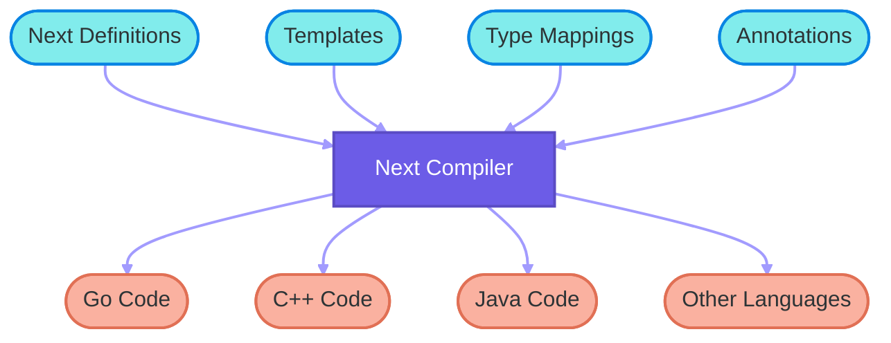

import Tabs from '@theme/Tabs';
import TabItem from '@theme/TabItem';
import Admonition from '@theme/Admonition';

# Get Started

## Introduction

Next is an advanced Interface Definition Language (IDL) designed for efficient and flexible code generation across multiple programming languages.

Next allows developers to define constants, enums, structures, interfaces, and more in a language-agnostic manner. It then uses a powerful template system to generate code for various target languages, making it an ideal choice for projects that need to maintain consistency across different programming environments.

## Key Features

1. **Multi-Language Support**: Generate code for various programming languages from a single definition.
2. **Declarative Syntax**: Clear syntax for defining constants, enums, structures, and interfaces.
3. **Annotations**: Provide additional metadata or instructions for code generation.
4. **Template-Based Generation**: Use customizable templates for flexible code output.

## How It Works

1. **Define Once**: Write your data structures, enums, and interfaces in Next.
2. **Annotate**: Use annotations to provide language-specific details or additional metadata.
3. **Template**: Create or use existing templates for your target languages.
4. **Generate**: Use the Next compiler to generate code for multiple languages from your single definition.



Next streamlines development processes, reduces code duplication, and ensures consistency across polyglot projects. Whether you're working on a small script or a large-scale distributed system, Next provides the tools to make your development process more efficient and less error-prone.

## Installation

<Tabs
  defaultValue="unix"
  values={[
    { label: 'Unix-like', value: 'unix' },
    { label: 'Windows', value: 'windows' },
    { label: 'Source Code', value: 'source' },
  ]}>

  <TabItem value="unix">
  To install Next on Unix-like systems (`Linux`, `macOS`, `Git Bash for Windows`, etc.), you can use the following command:

  ```sh
  curl -fsSL https://getnext.sh | sh
  ```

  This script will download and install the latest version of Next on your system.
  </TabItem>

  <TabItem value="windows">
  For Windows users, follow these steps:

  1. Download the installation package from [Downloads](/docs/downloads) for windows.
  2. Extract the downloaded ZIP file.
  3. Right-click on the `install.bat` file in the extracted folder.
  4. Select "Run as administrator" to execute the installation script.

  This will install the Next on your Windows system.
  </TabItem>

  <TabItem value="source">
  To install Next from source, use the following command:

  ```sh
  go install github.com/next/next@latest
  ```

  Make sure you have [Go](https://go.dev) `1.23+` installed on your system before running this command.
  </TabItem>
</Tabs>

:::tip
After you installed `next`, run `next version` to show the version informarion

```sh
next version
```

Run `next -h` to show the command usage.

```sh
next -h
```
:::

:::tip
<details>
<summary>Install Editor Extensions</summary>

<Tabs
  defaultValue="vscode"
  values={[
    { label: 'VSCode', value: 'vscode' },
  ]}>
  <TabItem value="vscode">
  Install Visual Studio Code Extension for Next from [marketplace](https://marketplace.visualstudio.com/items?itemName=nextlangorg.nextlang)

  This extension provides syntax highlighting, and other helpful features for Next development in Visual Studio Code. You can install it directly from the provided link or search for `next lang` in the Visual Studio Code Extensions marketplace.
  </TabItem>
</Tabs>
</details>
:::

## Write a Next source file

First of all, You need write a Next source file which has extension `.next` used to define constants, enums, structures and interfaces. Here is an example Next file:

<details>
<summary>example.next</summary>

```next
@next(
    go_package="github.com/next/next/testdata/gen/go/demo",
    cpp_package="demo",
    c_package="DEMO_",
    java_package="com.example.demo",
    csharp_package="Demo",
)
package demo;

const Version = "1.0.0"; // String constant
const MaxRetries = 3; // Integer constant
const Timeout = MaxRetries * 1000.0; // Float constant expression

// Color represents different color options
// Values: Red (1), Green (2), Blue (4), Yellow (8)
@next(type=int8)
enum Color {
    Red = 1 << iota;
    Green;
    Blue;
    Yellow;
}

// MathConstants represents mathematical constants
enum MathConstants {
    Pi = 3.14159265358979323846;
    E = 2.71828182845904523536;
}

// User represents a user in the system
struct User {
    int64 id;
    string username;
    vector<string> tags;
    map<string, int> scores;
    array<float64, 3> coordinates;
    Color favoriteColor;
    @deprecated string email;
    any extra;
}

// uint64 represents a 64-bit unsigned integer.
// - In Go, it is aliased as uint64
// - In C++, it is aliased as uint64_t
// - In Java, it is aliased as long
// - In Rust, it is aliased as u64
// - In C#, it is aliased as ulong
// - In Protobuf, it is represented as uint64
// - In other languages, it is represented as a struct with low and high 32-bit integers.
@next(
    go_alias="uint64",
    cpp_alias="uint64_t",
    java_alias="long",
    rust_alias="u64",
    csharp_alias="ulong",
    protobuf_alias="uint64",
)
struct uint64 {
    int32 low;
    int32 high;
}

// uint128 represents a 128-bit unsigned integer.
// - In rust, it is aliased as u128
// - In other languages, it is represented as a struct with low and high 64-bit integers.
@next(rust_alias="u128")
struct uint128 {
    uint64 low;
    uint64 high;
}

// Contract represents a smart contract
struct Contract {
    uint128 address;
    any data;
}

// OperatingSystem represents different operating systems
enum OperatingSystem {
    Windows = "windows";
    Linux = "linux";
    MacOS = "macos";
    Android = "android";
    IOS = "ios";
}

// LoginRequest represents a login request message (type 101)
// @message annotation is a custom annotation that generates message types.
@message(type=101, req)
struct LoginRequest {
    string username;
    string password;
    // @optional annotation is a custom annotation that marks a field as optional.
    @optional string device;
    @next(available="!protobuf")
    @optional(default=OperatingSystem.IOS) OperatingSystem os;

    // @optional is not supported for array, vector, and map fields:
    //
    // Bad example:
    //  @optional array<float64, 3> coordinates;
    //  @optional vector<string> tags;
    //  @optional map<string, int> scores;

    @next(proto_type="fixed64")
    int64 timestamp;
}

// LoginResponse represents a login response message (type 102)
@message(type=102)
struct LoginResponse {
    string token;
    User user;
}

// Reader provides reading functionality
interface Reader {
    // Read reads data into the buffer
    //
    // @next(error) applies to the method:
    // - For Go: The method may return an error
    // - For C++/Java: The method throws an exception
    //
    // @next(mut) applies to the method:
    // - For C++: The method is non-const
    // - For other languages: This annotation may not have a direct effect
    //
    // @next(mut) applies to the parameter buffer:
    // - For C++: The parameter is non-const, allowing modification
    // - For other languages: This annotation may not have a direct effect, 
    //   but indicates that the buffer content may be modified
    @next(error, mut)
    Read(@next(mut) bytes buffer) int;
}

@next(
    available="go|java",
    go_alias="net/http.Handler",
    java_alias="java.util.function.Function<com.sun.net.httpserver.HttpExchange, String>",
)
interface HTTPHandler {}

@next(available="go|java")
interface HTTPServer {
    // @next(error) indicates that the method may return an error:
    // - For Go: The method returns (LoginResponse, error)
    // - For C++/Java: The method throws an exception
    @next(error)
    Handle(string path, HTTPHandler handler);
}

// HTTPClient provides HTTP request functionality
interface HTTPClient {
    // Available for all languages
    Request(string url, string method, string body) string;

    // Available for Go and Java
    @next(error, available="!go & !java")
    Get(string url) string;

    // Available for C++
    @next(error, available="cpp")
    Post(string url, string body) string;
}
```
</details>

## Write a Next template file

Second, write a Next template file which has extension `.npl` used to constrol how to generate code for specified language. Here is an example template file used to generate `c++` code.

<details>
<summary>example.cpp.npl</summary>

```npl
{{/* Define metadata for entrypoint template file */}}
{{- define "meta/this"}}file{{end -}}
{{- define "meta/path"}}{{this.Package.Name}}/{{this.Name}}.next.h{{end -}}

{{- /* Overrides "next/cpp/import" */ -}}
{{- define "cpp/import" -}}
#include "../{{.File.Package.Name}}/{{.File.Name}}.next.h"
{{- end -}}

{{- /* Overrides "next/cpp/struct.fields": add method 'message_type' for each message after fields */ -}}
{{- define "cpp/struct.fields" -}}
{{- super .}}
{{- with .Decl.Annotations.message.type}}

    static int message_type() { return {{.}}; }
{{- end}}
{{- end -}}

{{head}}

{{next this}}
```
</details>

## Generate code

Finally, run `next` command to generate code using `example.next` and `example.cpp.npl`:

```sh
next -T cpp=example.cpp.npl -O cpp=gen/cpp/ example.next
```

This will generated a file as following:

<details>
<summary>example.h</summary>

```cpp
// Code generated by "next v0.0.3"; DO NOT EDIT.

#pragma once

#include <any>
#include <array>
#include <cstdint>
#include <map>
#include <string>
#include <unordered_map>
#include <vector>

namespace demo {

// Enums forward declarations
enum class Color;
/* enum */ class MathConstants;
/* enum */ class OperatingSystem;

// Classes forward declarations
class User;
class Uint128;
class Contract;
class LoginRequest;
class LoginResponse;

static constexpr auto Version = "1.0.0"; // String constant
static constexpr auto MaxRetries = 3; // Integer constant
static constexpr auto Timeout = 3000; // Float constant expression

// Color represents different color options
// Values: Red (1), Green (2), Blue (4), Yellow (8)
enum class Color : int8_t {
    Red = 1,
    Green = 2,
    Blue = 4,
    Yellow = 8,
};

/* enum */ class MathConstants {
private:
    double value;

public:
    static inline constexpr double Pi = 3.14159265358979323846;
    static inline constexpr double E = 2.71828182845904523536;

    MathConstants(const double& v) : value(v) {}

    bool operator==(const MathConstants& other) const {
        return value == other.value;
    }

    operator double() const {
        return value;
    }
};

/* enum */ class OperatingSystem {
private:
    std::string value;

public:
    static inline const std::string Windows = "windows";
    static inline const std::string Linux = "linux";
    static inline const std::string MacOS = "macos";
    static inline const std::string Android = "android";
    static inline const std::string IOS = "ios";

    OperatingSystem(const std::string& v) : value(v) {}

    bool operator==(const OperatingSystem& other) const {
        return value == other.value;
    }

    operator std::string() const {
        return value;
    }
};

// User represents a user in the system
class User {
public:
    User() = default;
    ~User() = default;
    
    int64_t id;
    std::string username;
    std::vector<std::string> tags;
    std::unordered_map<std::string,int> scores;
    std::array<double,3> coordinates;
    Color favoriteColor;
    std::string email;
    std::any extra;
};

// uint128 represents a 128-bit unsigned integer.
// - In rust, it is aliased as u128
// - In other languages, it is represented as a struct with low and high 64-bit integers.
class Uint128 {
public:
    Uint128() = default;
    ~Uint128() = default;
    
    uint64_t low;
    uint64_t high;
};

// Contract represents a smart contract
class Contract {
public:
    Contract() = default;
    ~Contract() = default;
    
    Uint128 address;
    std::any data;
};

// LoginRequest represents a login request message (type 101)
// @message annotation is a custom annotation that generates message types.
class LoginRequest {
public:
    LoginRequest() = default;
    ~LoginRequest() = default;
    
    std::string username;
    std::string password;
    // @optional annotation is a custom annotation that marks a field as optional.
    std::string device;
    OperatingSystem os;
    int64_t timestamp;

    static int message_type() { return 101; }
};

// LoginResponse represents a login response message (type 102)
class LoginResponse {
public:
    LoginResponse() = default;
    ~LoginResponse() = default;
    
    std::string token;
    User user;

    static int message_type() { return 102; }
};

// Reader provides reading functionality
class Reader {
public:
    virtual ~Reader() = default;
    
    // Read reads data into the buffer
    // 
    // @next(error) applies to the method:
    // - For Go: The method may return an error
    // - For C++/Java: The method throws an exception
    // 
    // @next(mut) applies to the method:
    // - For C++: The method is non-const
    // - For other languages: This annotation may not have a direct effect
    // 
    // @next(mut) applies to the parameter buffer:
    // - For C++: The parameter is non-const, allowing modification
    // - For other languages: This annotation may not have a direct effect,
    //   but indicates that the buffer content may be modified
    virtual int read(std::vector<unsigned char>& buffer) = 0;
};

// HTTPClient provides HTTP request functionality
class HTTPClient {
public:
    virtual ~HTTPClient() = default;
    
    // Available for all languages
    virtual std::string request(const std::string& url, const std::string& method, const std::string& body) const = 0;
    // Available for C++
    virtual std::string post(const std::string& url, const std::string& body) const = 0;
};

} // namespace demo
```
</details>


## How to generate multi-language codes?

It's easy to generate many other langauge codes by writing template files. Here is an example to generate `java` code.

<details>
<summary>template files</summary>

<Tabs
  defaultValue="constants"
  values={[
    { label: 'constants.java.npl', value: 'constants' },
    { label: 'enum.java.npl', value: 'enum' },
    { label: 'struct.java.npl', value: 'struct' },
    { label: 'interface.java.npl', value: 'interface' },
  ]}>

  <TabItem value="constants">
  This template file used to generated all constants in a file `Constants.java` which define a `Constants` class to holds all constants.
  ```npl
  {{- define "meta/this"}}file{{end -}}
  {{- define "meta/class"}}Constants{{end -}}
  {{- define "meta/path"}}{{render "package:name" this.Package | replace "." "/"}}/{{meta.class}}.java{{end -}}
  {{- define "meta/skip"}}{{eq 0 (len this.Decls.Consts.List)}}{{end -}}
  
  {{- define "java/file" -}}
  package {{render "package:name" .Package}};
  
  public class {{meta.class}} {
  {{- next .Decls.Consts}}
  }
  {{- end -}}
  
  {{head}}
  
  {{next this}}
  ```

  Example output:
  ```java
  // Code generated by "next v0.0.3"; DO NOT EDIT.
  
  package com.example.demo;
  
  public class Constants {
      public static final String VERSION = "1.0.0"; // String constant
      public static final long MAXRETRIES = 3l; // Integer constant
      public static final long TIMEOUT = 3000l; // Float constant expression
  }
  ```
  </TabItem>

  <TabItem value="enum">
  ```npl
  {{- define "meta/this"}}enum{{end -}}
  {{- define "meta/path"}}{{render "package:name" this.Package | replace "." "/"}}/{{next this.Type}}.java{{end -}}
  
  {{- define "java/enum" -}}
  package {{render "package:name" .Package}};
  
  {{super .}}
  {{- end -}}
  
  {{head}}
  
  {{next this}}
  ```

  Example output:
  ```java
  // Code generated by "next v0.0.3"; DO NOT EDIT.
  
  package com.example.demo;
  
  /**
   * Color represents different color options
   * Values: Red (1), Green (2), Blue (4), Yellow (8)
   */
  public enum Color {
      Red((byte) 1),
      Green((byte) 2),
      Blue((byte) 4),
      Yellow((byte) 8);
  
      private final byte value;
  
      Color(byte value) {
          this.value = value;
      }
  
      public byte getValue() {
          return value;
      }
  }
  ```
  </TabItem>

  <TabItem value="struct">
  ```npl
  {{- define "meta/this"}}struct{{end -}}
  {{- define "meta/path"}}{{render "package:name" this.Package | replace "." "/"}}/{{next this.Type}}.java{{end -}}
  
  {{- /* Overrides "next/java/struct": add package and imports before struct */ -}}
  {{- define "java/struct" -}}
  package {{render "package:name" .Package}};
  
  {{next .File.Imports}}
  {{super .}}
  {{- end -}}
  
  {{- /* Overrides "next/java/struct.fields": add method 'MessageType' for each message after fields */ -}}
  {{- define "java/struct.fields" -}}
  {{- super .}}
  {{- with .Decl.Annotations.message.type}}
  
      public static int MessageType() { return {{.}}; }
  {{- end}}
  {{- end -}}
  
  {{head}}
  
  {{next this}}
  ```

  Example output:

  ```java
  // Code generated by "next v0.0.3"; DO NOT EDIT.
  
  package com.example.demo;
  
  import java.util.List;
  import java.util.Map;
  import java.util.Arrays;
  
  /**
   * Contract represents a smart contract
   */
  public class Contract {
      private Uint128 address;
  
      public Uint128 getAddress() {
          return address;
      }
  
      public void setAddress(Uint128 address) {
          this.address = address;
      }
  
      private Object data;
  
      public Object getData() {
          return data;
      }
  
      public void setData(Object data) {
          this.data = data;
      }
  
      public Contract() {}
  }
  ```
  </TabItem>

  <TabItem value="interface">
  ```npl
  {{- define "meta/this"}}interface{{end -}}
  {{- define "meta/path"}}{{render "package:name" this.Package | replace "." "/"}}/{{next this.Type}}.java{{end -}}
  
  {{- /* Overrides "next/java/interface": add package and imports before interface */ -}}
  {{- define "java/interface" -}}
  package {{render "package:name" .Package}};
  
  {{next .File.Imports}}
  {{super .}}
  {{- end -}}
  
  {{head}}
  
  {{next this}}
  ```

  Example output:
  ```java
  // Code generated by "next v0.0.3"; DO NOT EDIT.
  
  package com.example.demo;
  
  import java.util.List;
  import java.util.Map;
  import java.util.Arrays;
  
  /**
   * Reader provides reading functionality
   */
  interface Reader {
      /**
       * Read reads data into the buffer
       * 
       * @next(error) applies to the method:
       * - For Go: The method may return an error
       * - For C++/Java: The method throws an exception
       * 
       * @next(mut) applies to the method:
       * - For C++: The method is non-const
       * - For other languages: This annotation may not have a direct effect
       * 
       * @next(mut) applies to the parameter buffer:
       * - For C++: The parameter is non-const, allowing modification
       * - For other languages: This annotation may not have a direct effect,
       *   but indicates that the buffer content may be modified
       */
      int Read(byte[] buffer) throws Exception;
  }
  ```
  </TabItem>
</Tabs>
</details>

:::note
To generate `java` code, we need write templates for each declaration types: `enum`, `struct`, `interface`. Specially, write a template file to generate all constants in a single file `Constants.java`.
:::

Run `next` to generate multi-language codes as following(we assume `*.java.npl` files placed in dir `java`):

```sh
next -T cpp=example.cpp.npl -O cpp=gen/cpp/ -T java=java/ -O java=gen/java/ example.next
```