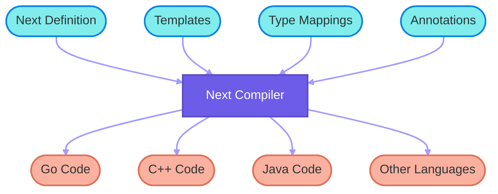

# Overview

Next is an advanced Interface Definition Language (IDL) designed for efficient and flexible code generation across multiple programming languages. This guide will walk you through the key concepts, syntax, and features of Next, helping you harness its power for your projects.

## Introduction

Next allows developers to define data structures, constants, interfaces, and more in a language-agnostic manner. It then uses a powerful template system to generate code for various target languages, making it an ideal choice for projects that need to maintain consistency across different programming environments.




## Key Features

1. **Multi-Language Support**: Generate code for various programming languages from a single definition.
2. **Declarative Syntax**: Clear syntax for defining structures, enums, constants, and interfaces.
3. **Annotations**: Provide additional metadata or instructions for code generation.
4. **Template-Based Generation**: Use customizable templates for flexible code output.
5. **Type System**: Support for basic and complex types like vectors and maps.

## Quick Demo

Let's examine a simple example of Next code and its corresponding template:

### Next Code Example

```next
@next(
    go_package="github.com/YourName/YourRepo/demo",
    cpp_package="demo",
    java_package="com.example.demo"
)
package demo;

const Version = "1.0.0";
const MaxRetries = 3;

@next(type=int8)
enum Color {
    Red = 1 << iota;
    Green;
    Blue;
    Yellow;
}

struct User {
    int id;
    @optional Color color;
    @json(omitempty) @optional string name;
    @message int timestamp;
}

struct User {
    int64 id;
    string username;
    vector<string> tags;
    Color favoriteColor;
}

@message(type=101, req)
struct LoginRequest {
    string username;
    string password;
    @optional string device;
    @next(proto_type="fixed64")
    int64 timestamp;
}

interface UserService {
    @next(error)
    getUser(int64 id) User;
    updateUserStatus(int64 id, Color favoriteColor) bool;
}
```

This Next code demonstrates:
- Package declaration with language-specific annotations
- Constant definitions
- Enum declaration with type annotation
- Struct definitions, including nested types and custom annotations
- Interface declaration with method annotations

### Template Example (C++)

```npl
{{- define "meta/this"}}file{{end -}}
{{- define "meta/path"}}{{this.Package.Name}}/{{this.Name}}.next.h{{end -}}

{{- define "cpp/import" -}}
#include "../{{.File.Package.Name}}/{{.File.Name}}.next.h"
{{- end -}}

{{- define "cpp/struct.fields" -}}
{{- super .}}
{{- with .Decl.Annotations.message.type}}

    static int message_type() { return {{.}}; }
{{- end}}
{{- end -}}

{{head}}

{{next this}}
```

This template showcases:
- Meta information definition
- Custom import statement formatting
- Addition of `message_type()` method for message structures

## How It Works

1. **Define Once**: Write your data structures, enums, and interfaces in Next.
2. **Annotate**: Use annotations to provide language-specific details or additional metadata.
3. **Template**: Create or use existing templates for your target languages.
4. **Generate**: Use the Next compiler to generate code for multiple languages from your single definition.

Next streamlines development processes, reduces code duplication, and ensures consistency across polyglot projects. Whether you're working on a small script or a large-scale distributed system, Next provides the tools to make your development process more efficient and less error-prone.